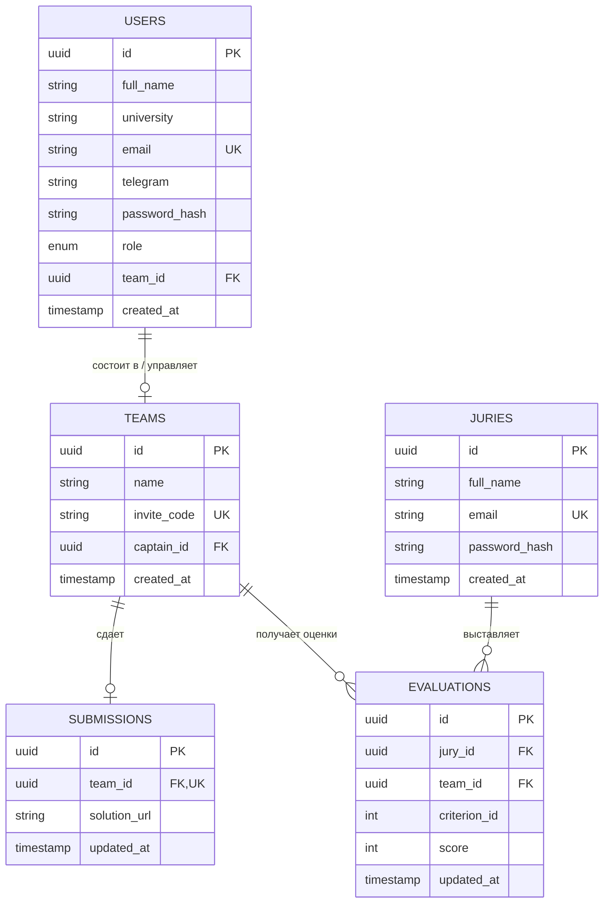

# database.md — Спецификация Реляционной Базы Данных (PostgreSQL)

---

## 1. Архитектура и Принципы Проектирования

База данных проектируется под управлением **PostgreSQL 16+**. Основной упор сделан на **строгую ссылочную целостность (Foreign Keys)**, **атомарность операций (ACID)** через транзакции и **уникальные индексы** для предотвращения состояния гонки (race conditions) на уровне СУБД.

### Ключевые особенности:

* **UUIDv4** в качестве первичных ключей (`PRIMARY KEY`) для предотвращения перебора ID.
* **Индексы** на все внешние ключи и поля частой выборки (`team_id`, `invite_code`, `email`).
* **Ограничения (CHECK constraints)** для контроля бизнес-правил прямо на уровне базы (длина инвайт-кода, диапазон оценок).
* **Каскадные действия (`ON DELETE SET NULL` / `ON DELETE CASCADE`)** для корректного удаления связей при расформировании команд.

---

## 2. Схема Базы Данных (ER-Диаграмма в формате Mermaid)



---

## 3. Описание Таблиц и SQL-Схема (Migration File)

### 3.1. Создание перечислений (ENUMs) и расширений

```sql
-- Включение расширения для генерации UUID
CREATE EXTENSION IF NOT EXISTS "uuid-ossp";

-- Роли пользователей в системе
CREATE TYPE user_role AS ENUM ('USER', 'ADMIN');

```

---

### 3.2. Таблица Пользователей (`users`)

Хранит учетные данные участников и администраторов.

```sql
CREATE TABLE users (
    id UUID PRIMARY KEY DEFAULT uuid_generate_v4(),
    full_name VARCHAR(255) NOT NULL,
    university VARCHAR(255) NOT NULL,
    email VARCHAR(255) UNIQUE NOT NULL,
    telegram VARCHAR(100) NOT NULL,
    password_hash VARCHAR(255) NOT NULL,
    role user_role NOT NULL DEFAULT 'USER',
    team_id UUID, -- NULL, если пользователь "Без команды"
    created_at TIMESTAMP WITH TIME ZONE DEFAULT CURRENT_TIMESTAMP NOT NULL
);

-- Индекс для быстрого поиска по Email при авторизации
CREATE INDEX idx_users_email ON users(email);
-- Индекс для получения списка участников конкретной команды
CREATE INDEX idx_users_team_id ON users(team_id);

```

---

### 3.3. Таблица Команд (`teams`)

Хранит информацию о командах и инвайт-кодах.

```sql
CREATE TABLE teams (
    id UUID PRIMARY KEY DEFAULT uuid_generate_v4(),
    name VARCHAR(100) NOT NULL,
    invite_code VARCHAR(8) UNIQUE NOT NULL,
    captain_id UUID NOT NULL,
    created_at TIMESTAMP WITH TIME ZONE DEFAULT CURRENT_TIMESTAMP NOT NULL,
    
    -- Проверка длины инвайт-кода
    CONSTRAINT chk_invite_code_length CHECK (char_length(invite_code) = 8)
);

-- Внешний ключ капитана (ссылается на users)
ALTER TABLE teams 
    ADD CONSTRAINT fk_teams_captain 
    FOREIGN KEY (captain_id) REFERENCES users(id) ON DELETE RESTRICT;

-- Связываем team_id в users с таблицей teams
ALTER TABLE users 
    ADD CONSTRAINT fk_users_team 
    FOREIGN KEY (team_id) REFERENCES teams(id) ON DELETE SET NULL;

-- Индекс для моментального поиска команды по 8-значному инвайт-коду
CREATE UNIQUE INDEX idx_teams_invite_code ON teams(invite_code);

```

---

### 3.4. Таблица Сданных Решений (`submissions`)

Хранит ссылки на решения участников (Яндекс.Диск / Google Drive).

```sql
CREATE TABLE submissions (
    id UUID PRIMARY KEY DEFAULT uuid_generate_v4(),
    team_id UUID UNIQUE NOT NULL REFERENCES teams(id) ON DELETE CASCADE,
    solution_url TEXT NOT NULL,
    updated_at TIMESTAMP WITH TIME ZONE DEFAULT CURRENT_TIMESTAMP NOT NULL,

    -- Проверка корректности формата URL на уровне СУБД
    CONSTRAINT chk_solution_url_format CHECK (solution_url ~* '^https?://.+')
);

-- Индекс для получения решения команды
CREATE UNIQUE INDEX idx_submissions_team_id ON submissions(team_id);

```

---

### 3.5. Таблица Аккаунтов Жюри (`juries`)

Изолированная таблица учетных записей экспертов.

```sql
CREATE TABLE juries (
    id UUID PRIMARY KEY DEFAULT uuid_generate_v4(),
    full_name VARCHAR(255) NOT NULL,
    email VARCHAR(255) UNIQUE NOT NULL,
    password_hash VARCHAR(255) NOT NULL,
    created_at TIMESTAMP WITH TIME ZONE DEFAULT CURRENT_TIMESTAMP NOT NULL
);

-- Индекс для входа жюри
CREATE INDEX idx_juries_email ON juries(email);

```

---

### 3.6. Таблица Оценок Жюри (`evaluations`)

Хранит независимые оценки экспертов по каждому критерию.

```sql
CREATE TABLE evaluations (
    id UUID PRIMARY KEY DEFAULT uuid_generate_v4(),
    jury_id UUID NOT NULL REFERENCES juries(id) ON DELETE CASCADE,
    team_id UUID NOT NULL REFERENCES teams(id) ON DELETE CASCADE,
    criterion_id INT NOT NULL, -- ID критерия из ТЗ (например, 1..5)
    score INT NOT NULL,
    updated_at TIMESTAMP WITH TIME ZONE DEFAULT CURRENT_TIMESTAMP NOT NULL,

    -- Ограничение диапазона оценок (например, от 0 до 10 баллов)
    CONSTRAINT chk_evaluations_score CHECK (score >= 0 AND score <= 10),
    
    -- Уникальный составной ключ: Одно жюри ставит ровно одну оценку по одному критерию конкретной команде
    CONSTRAINT uq_jury_team_criterion UNIQUE (jury_id, team_id, criterion_id)
);

-- Индексы для быстрого подсчета суммы баллов и генерации Excel-отчета
CREATE INDEX idx_evaluations_team ON evaluations(team_id);
CREATE INDEX idx_evaluations_jury ON evaluations(jury_id);

```

---

## 4. Гарантии Целостности и Бизнес-Кейсы в SQL

### 4.1. Контроль вместимости команды (Лимит 2–4 человека)

Проверка количества участников перед добавлением выполняется на уровне асинхронной PostgreSQL-транзакции бэкенда с использованием `FOR UPDATE`:

```sql
-- Пример транзакции Join Team на стороне Go/PostgreSQL:
BEGIN;

-- Блокируем запись команды для предотвращения состояние гонки (Race Condition)
SELECT id FROM teams WHERE invite_code = 'X8K2M9N7' FOR UPDATE;

-- Проверяем текущее количество участников
SELECT COUNT(*) FROM users WHERE team_id = $1;

-- Если COUNT < 4:
UPDATE users SET team_id = $1 WHERE id = $user_id AND team_id IS NULL;

COMMIT;

```

### 4.2. Расформирование команды капитаном (`Disband`)

Благодаря правилу `ON DELETE SET NULL` в внешнем ключе `fk_users_team` и `ON DELETE CASCADE` в `submissions`, удаление команды автоматически освобождает всех её участников и очищает сданное решение за 1 атомарную операцию:

```sql
-- При расформировании команды:
DELETE FROM teams WHERE id = $team_id AND captain_id = $captain_id;
-- Результат: У всех участников team_id автоматически становится NULL, решение из submissions удаляется.

```

---

## 5. Оптимизированный Запрос для Excel-Экспорта (Admin)

Сводная агрегирующая выборка всех результатов для формирования `.xlsx` таблицы без лишних вычислений в Go:

```sql
SELECT 
    t.id AS team_id,
    t.name AS team_name,
    u_cap.full_name AS captain_name,
    u_cap.telegram AS captain_telegram,
    COALESCE(s.solution_url, 'НЕ СДАНО') AS solution_url,
    COUNT(DISTINCT u.id) AS total_members,
    COALESCE(SUM(e.score), 0) AS total_score
FROM teams t
JOIN users u_cap ON t.captain_id = u_cap.id
LEFT JOIN users u ON u.team_id = t.id
LEFT JOIN submissions s ON s.team_id = t.id
LEFT JOIN evaluations e ON e.team_id = t.id
GROUP BY t.id, t.name, u_cap.full_name, u_cap.telegram, s.solution_url
ORDER BY total_score DESC;

```